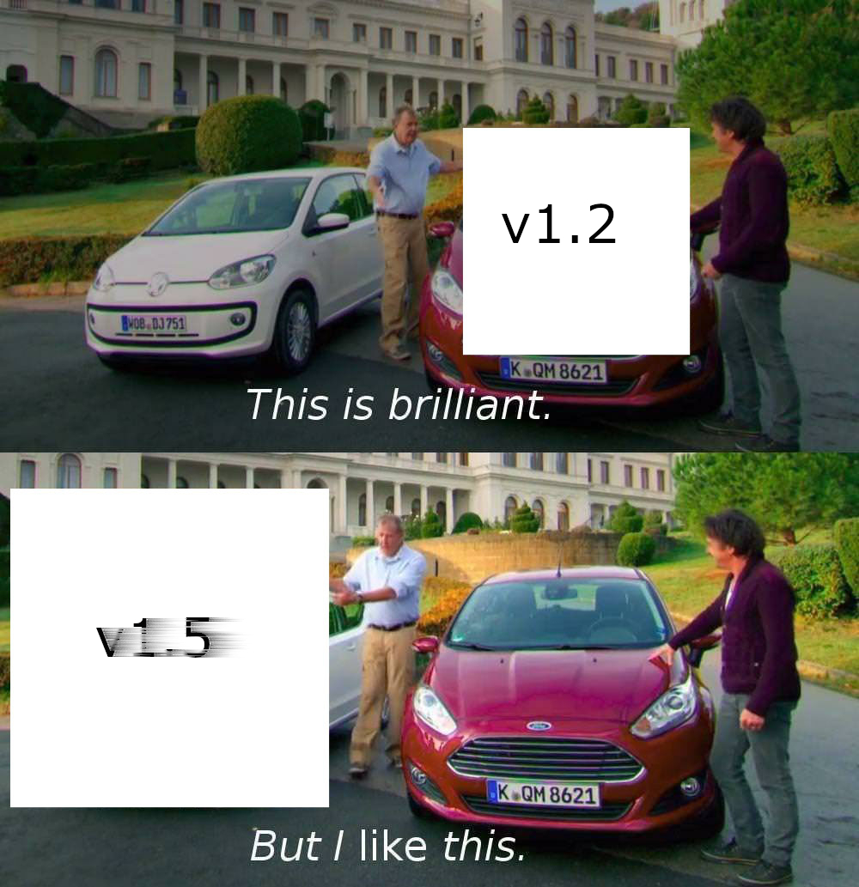
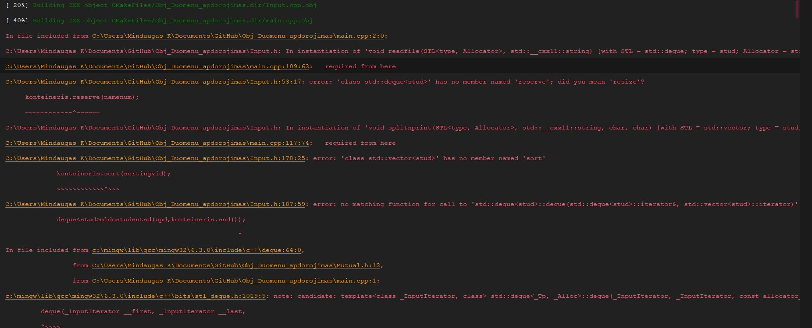

## Įdiegimo instrukcija
1. Clone'inam repositoriją ```$ git clone https://github.com/gitguuddd/Obj_Duomenu_apdorojimas.git```
2. Compile'inam programą paleisdami CMakeLists.txt failą
3. Norint nuskaityti informaciją nuo failo reikia sukurti kursiokai.txt failą su tokia struktūra 
```shell
Pavarde     Vardas      ND1  ND2  ND3  ND4  ND5  ND6  ND7  ND8  Egzaminas
Pavarde1    Vardas1     10   9    4    6    4    5    0    4    7
Pavarde2    Vardas2     10   0    6    7    9    4    2    5    3
Pavarde3    Vardas3     10   0    3    b    5    2    1    4    5
```
- Paleidžiame programą
---
## Naudojimosi instrukcija
- Paleidųs programą programa paklaus vartotojo kokiu režimu jis nori vykdyti programą: išsamiu ar konkrečiu
- Išsamus režimas pasižymi labai didele pasirinkimo galimybe - kiekvienam generuojamam  studentu failui galima priskirti skirtingą skaičių namų darbų, galutinio pažymio skaičiavimo būdą. Šis režimas yra apkrautas vartotojo įvestimi
- Konkretus režimas kiek galima labiau sumažina vartotojo įvesčių kiekį - generuojant failus reikia tik vieną kartą įvesti namų darbų skaičių ir galutinio pažymio skaičiavimo būdą
- Paleidųs programą ir pasirinkųs režimą bus matomas toks vaizdas
```shell
Saugomi 0 studentu(o) duomenys, pasirinkite ka daryti toliau:
1. Ivesti studenta paciam
2. Generuoti studenta
3. Skaityti is failo
4. Atspausdinti (galutinis pagal nd mediana)
5. Atspausdinti (galutinis pagal nd vidurki)
6. Generuoti studentu faila (v1.0)
7. Skelti studentus i maladec ir L-laivo sarasus, atspausdinti
```
- Pasirinkite norimą funkciją ivesdami jos numerį. Input'ai apsaugoti tai galima ir pasiaust :D
- Po 1, 2 arba 3 funkcijos įvykdomo programa grįžta į meniu, atnaujinamas saugomų studentų rodiklio skaičius
- 4, 5, 7 funkcijos neveiks, jei nebus saugomi bent vieno studento duomenys
- Po 4, 5, 6 arba 7 funkcijos įvykdymo programa baigia darbą
---
## Versijų istorija (changelog)

---
### [v2.0](https://github.com/gitguuddd/Obj_Duomenu_Apdorojimas_class/releases/tag/v2.0)
**Pridėta**
- Doxygen dokumentacija (Latex ir HTML formatai) Doxygen aplankale
- ```Obj_test``` aplankalas kuriame saugomi unit testai, paleidžiami per runBasicClasstests. Testai ir jų rezultatai aprašyti benchmark skiltyje. Unit testams naudojamas gtest 1.8.1

**Koreguota**
- Refactorinta visa programa naudojant snake_case ir kitus c++ kodo rašymo standartus
- Restrukturizuota programa - dėl gtest visi programai reikalingi failai išskyrus main.cpp randami ```code``` aplankale
- ```Humie``` padaryta abstrakčia klase
- Pakoreguotas spausdinimo lygiavimas

---
### [v1.5](https://github.com/gitguuddd/Obj_Duomenu_Apdorojimas_class/releases/tag/v1.5)
(2019-05-07)


**Pridėta**
- ```Stud``` derived klasės abstrakti bazinė klasė ```Humie```
- ```Important_Values``` klasė kurioje saugomi ir apsaugomi seniau per visą programą buvę išmėtyti globalūs kintamieji
- ```Stud``` klasės >> ir << operatoriai
- ```Stud``` klasės ```scan_name``` ir ```scan_surname``` funkcijos
- ```handle_nd``` funkcija skirta ```ndcount``` kintamojo įvedimo į ```Important_Values``` tikrinimui

**Koreguota**
- Iš ```Stud``` klasės į ```Humie``` klasę perkelti ```m_name, m_surname, m_nd``` kintamieji ir su jais susyjusios funkcijos. Taip užtikrinama, kad ```Humie``` klasė saugos įvestus duomenis, o ```Stud``` klasė - išvedimui paruoštus duomenis
- Panaikinti beveik visi padriki globalūs kintamieji (palikti globalūs vektoriai, dekai, listai ir t.t). Minėti kintamieji perkelti į ```Important_Values``` klasę
- Dėl sutikto "circular include" teko pertvarkyt headeriuose include'intus kitus headerius :(
- Realizuotų >> ir << ```Stud``` klasės operatorių deka buvo pertvarkytos template'inė ```read_file2``` , nuskaitymo nuo ```kursiokai.txt``` failo ```read_file2```, template'inė spausdinimo į failą ```print_to_file``` funkcijos
- Į github pridėtas ```build``` aplankas su jame esančiu kursiokai.txt failu
- Atnaujinta informacija apie programos struktūra

**Žinomos problemos/ką galima pagerinti**
- Vis dar galima patobulinti programos struktūrą
- Kintamųjų ir funkcijų pavadinimų standartai :DD

---
### [v1.2](https://github.com/gitguuddd/Obj_Duomenu_Apdorojimas_class/releases/tag/v1.2)
(2019-05-02)


**Pridėta**
- ```Rule of five``` ```Stud``` klasės operatoriai
- Įvairūs ```Stud``` klasės palyginimo operatoriai

**Koreguota**
- Programos veikimo laiko skaičiavimas dabar realizuojamas per ```Timer.h``` klasę
- Stud klasė ir jos funkcijos iš ```Mutual.h``` ir ```Mutual.cpp``` iškeliamos į ```Stud.h``` ir ```Stud.cpp```
- ```Stud.h, Stud.cpp, Timer.h``` failai laikomi classes aplankale
- Programos metu sugeneruoti failai saugomi ```build``` aplankale
- Dokumentacijoje atnaujinta informacija apie programos struktūrą
---
### [v1.1](https://github.com/gitguuddd/Obj_Duomenu_Apdorojimas_class/releases/tag/v1.1)
(2019-04-23)


**Koreguota**
- ```Stud``` struktūra pakeičiama į ```Stud``` klasę
- Iš klasės narių panaikinti tarpiniai ```vid``` ir ```mvid``` kintamieji, nes galutinio balo(vidurkis) ir galutinio balo(mediana) skaičiavimai vyksta setteriuose
- Pagal ```Clang-tidy``` rekomendacijas keliose vietose panaudotas ```std::move```
- Panaikinta daug perteklinių try-catch blokų

**Žinomi bugai/ ką galima patobulinti**
- Programos struktūra is still a wreck
- Kartais ```L_laivas``` STL konteineryje galima išvysti vieną studentą su galutiniu balu, kuris lygus ```5```, galima custom predicate problema
- Galima patobulinti ir pačią klasę - padaryti ją suprantamesne
- Pats metas pradėti taikyti kintamųjų ir funkcijų pavadinimų standartus
---
### [v1.0.1](https://github.com/gitguuddd/Obj_Duomenu_apdorojimas/releases/tag/v1.0.1)
(2019-03-27)

**Pridėta**
- Funkcijos ```t_gavo_skola, rask_Minkstus, rask_Minkstus_d, rask_Kietus, rask_Kietus_d```
- Papildomos užduoties siūlomi splitinimo variantai pridėti kaip papildoma ```d``` splitinimo strategija
- Pridėta galimybė pasirinkti programos veikimo rėžima: išsamus/konkretus
- Skeliant studentus naudojant papildomos užduoties algoritmus skėlimo laikai bus išvedami į ```Papildomos_uzduoties_laikai.txt``` failą
- Kai vartotojas pats įveda vardą/pavardę programa tikrina ar varde/pavardėje yra tik raidės, atradųs kitokį simbolį vardas/pavardė yra keičiami į ```BadInput```

**Koreguota**
- Sutvarkyti keli README.md failo bug'ai
- Pertvarkyta README.md failo struktūra
- visi README.md paveiksliukai sukelti į ```Memes``` folderį


---
### [v1.0](https://github.com/gitguuddd/Obj_Duomenu_apdorojimas/releases/tag/v1.0)
(2019-03-25)

**Pridėta**
- Prie naudojamos ```c``` splitinimo strategijos pridėtos ```a``` ir ```b``` strategijos (apie jas - vėliau)
- Splitinimo strategijos pasirinkimo funkcija ```Strat_pick```

**Koreguota**
- Sutvarkytas minor bug'as: išvedant skaičiavimus pagal mediana rašydavo, kad galutinis vertinimas buvo skaičiuotas pagal vidurkį
- Pasirodo, kad listo nebuvo įmanoma panaudoti su didesniais studentų kiekiais vien dėl mano kaltės, nes neišvalydavau temp struktūros.
- Paspartintas readinimas iš failo: eilutės duomenys nuskaitomi į temp struktūra. Priėjųs eilutės galą, struktūra yra pushbackinama STL konteineryje.
- Pasikartojantis kodas printinimo, skaičiavimo, vardų analižės vietose pakeistas kreipimusi į template funkcijas ```print_to_file ,calc , names```
- README fail'e pridėtos naudojimosi, įdiegimo instrukcijos.

---
### [v0.5](https://github.com/gitguuddd/Obj_Duomenu_apdorojimas/releases/tag/v0.5)
(2019-03-18)



**Pridėta**
- ```split_n_print``` ir ```read_file2``` funkcijoms sukurti listo ir deque variantai, nes labai pasisekė kurti funkcijų template'us (žiūrėti viršuje :) )
- ```t_STL_pick``` funkcija, kuri leidžia vartotojui pasirinkti ar jis norės dirbti su vektoriumi/deku/listu
- Naujuose inputuose sudėtas input handling'as
- Į benchmark'o failą (v0.5_laikai.txt) išvedamas ir pasirinkto STL konteinerio pavadinimas
- Nustatyta, kad listas lūžta, kai perlipa 19800 saugomų studentų skačių, listo generavimas apribotas iki 10000 studentų.
- 

**Koreguota**
- Visur sutvarkytas lygiavimas
- ```v0.4_laikai.txt``` keičiama į ```v0.5_laikai.txt```
- ```Generuoti studentu faila (v0.4)``` keičiama į ```Generuoti studentu faila (v0.5)``` 
- Pasirodo, kad ```Generuoti studentu faila (v0.5)``` funkcija visados generuodavo vienu studentu mažiau nei reikia. Tai sutvarkyta
- Namų darbų skaičiaus maksimalus pasirinkimas padidintas iki 1000000
- Keliose vietose panaikinti nereikalingi try-catch blokai
- Po 0.5 studentų generavimo programa į menių negrįžta ir tiesiog baiga darbą.

---
### [v0.4](https://github.com/gitguuddd/Obj_Duomenu_apdorojimas/releases/tag/v0.4)
(2019-03-11)


**Pridėta**

- ```Generuoti studentu faila (v0.4)``` meniu pasirinkimas kuris apjungia šias naujas funkcijas:
- **overload'inta ```gen_student``` funkcija**, kuri sugeneruoja nurodytą kiekį studentų
   su atsitiktinais vardais, pavardėmis
   , egzaminų įverčiais ir vartotojo nurodytu namų darbų įverčių kiekiu ir šiuos duomenis išveda į failus su atitinkamais pavadinimais ```generuojamu studentu kiekis + studentu.txt```
- ```read_file2``` **funkcija** kuri nuskaito duomenis iš sugeneruotų failų ir juos sudeda į students vektorių.
- ```split_n_print``` **funkcija** kuri, pagal vartotojo pasirinkimą ([m]ediana/[v]idurkis) suskaičiuoja studentų vektoriuje saugomų studentų galutinius pažymius pagal namų darbų įverčių medianą/namų darbų įverčių vidurkį, 
išrikiuoja stundentus pagal galutinį pažymį,
 randa iteratorių ties kuriuo galutinis pažymys tampa lygus 5.0, panaudoja iteratorių skeliant studentų sąrašą į ```mldc``` studentus ir ```L_laivas``` studentus, juos atspausdina į failus su atitinkamais vardais ``` studentu skaičius + studentu + v/m + mldc/L_laivas```
- Naudojant ```high_resolution_clock``` išmatuotas ```gen_student```, ```read_file2``` ir ```split_n_print``` veikimo laikai dirbant su visais studentų sąrašų variantais (10, 100, 1000, 10000, 100000, 1000000), laikai išvedami į ```v0.4_laikai.txt``` failą
- Naujose funkcijose pridėtas input/exception handling'as
- Dabar galima skelti ir atspausdinti ir duomenis kurie buvo sugeneruoti/įvesti paties naudotojo arba nuskaityti iš kursiokai.txt failo

**Koreguota**

- Kursioko Igno D. patarimu mt19937 seedinimas pakeistas iš random device
 į ```high_resolution_clock::now().time_since_epoch().count()```, nes pasirodo, kad mano kompiuteris neturi random device :(
- Sutvarkyti keli minor bug'ai susyję su informacijos išvedimu konsolėje
- Pakeistas README.md failas

**Ką artimiausiame release reiktų pataisyti, bet ko tikriausiai nepataisysių** 
- Skeliant vartotojo įvestus/sugeneruotus/nuskaitytus duomenis, sudaryti failai ne visados pasižymi puikiu lygiavimu
- Sugeneruoti studentų failai (dar neperskelti) irgi nėra puikiai išlygiuoti, nes iškart generuojant ir išvedant nėra galimybės surasti maxname ir maxsurname reikšmių
- Studentų sąrašų generavimas ir skėlimas prikuria labaiiii daug failų.
- Dėl multiple definition errorų į ```input.h``` ir ```input.cpp``` teko perkelti split_n_print funkciją, nors ji pagal veikimo principą turėtų priklausyti ```output.h``` ir ```output.cpp``` failams
- Per daug kintamųjų, kurie kaip extern'ai yra deklaruojami ```mutual.h``` 

**Laiko matavimo rezultatai ir pavyzdžiai** 
- Visi sarašai buvo sugeneruoti naudojant Release profilį ir -O3 flagą

---
### [v0.3](https://github.com/gitguuddd/Obj_Duomenu_apdorojimas/releases/tag/v0.3)
(2019-02-25)

**Pridėta**
- ```Input.h, Mutual.h, Output.h, Mutual.cpp, Output.cpp, Input.cpp```
- Input handling (pagrinde ```cin.fail()```)
- Naudojami ```vector.reserve()``` ir ```vector.shrink_to_fit()```
- Exception handling (```try - catch```) ties ```students.push_back``` ir ```Stud.nd.push_back```, nes pereita prie vektorių atminties rezervavimo
- Input handling nuskaitant failą - galima nuskaityti namų darbų pažymius net ir jei jie yra ne skaičiai arba mazesni uz 0/ didesni uz 10 (aptikus - nulinami), jei netinkamas input yra ilgesnis nei 4 simboliai - didelė rizika sugadinti nuskaitytų duomenų tikslumą 
- Nested switch meniu klaidų spausdinimui
- Programos struktūros sekcija README.MD faile
- 

**Koreguota**
- Panaikinti goto, taip pat ir easter egg (LINEKAPUT:), perdaryta switch logika.
- Pasirodo, kad senesnių versijų duomenys nebuvo labai tikslūs, duomenys patikslinti.
- kursiokai.txt failas tikslingai sucorruptintas norint išbandyti input handling'a.
---
### [v0.2](https://github.com/gitguuddd/Obj_Duomenu_apdorojimas/releases/tag/v0.2)
(2019-02-18)

**Pridėta**
 - Kursiokai.txt
 - Rūšiavimas pagal studento vardą ir pavardę
 - Nuskaitymas iš failo
 - Galimybė visais būdais gautus duomenis atspausdinti viename output sąraše
 - Primityvus switch'o error handling'as naudojant goto
 - Easter egg
 
 **Koreguota**
 - Pakeistas README.md failas
 
 **Žinomi trūkumai/ką reikia kuo greičiau ištaisyti**
 - Goto switche reikia pakeisti į normalų refactoringa dirbant prie v0.3
 - Studentų rikiavimas veiks keistokai jei bus naudojami ne vienodo ilgio vardai ir pavardės.
 - Nemažai vietų trūksta exception/error handling'o
---
### [v0.1](https://github.com/gitguuddd/Obj_Duomenu_apdorojimas/releases/tag/v0.1)
(2019-02-18)

**Pridėta**
- CMake failas
- Pirmininis programos ```cpp``` failas
- Alternatyvios programos (su masyvu ) ```cpp``` failas (veikiantis bardakas)

**Koreguota**
- Pakeistas README.md failas
---
## Benchmark'ai

**Truputis informacijos norint suprasti benchmarkus**
- Visi testai yra vykdomi Release profilyje
- Visi testai vykdomi su 10 namų darbų.
- Egzistuoja keturios skėlimo strategijos ```A, B, C, D```
- Strategija ```A``` - Studentai, kurių galutinis pažymys yra >= 5.0 yra perkeliami į ```mldc``` STL konteinerį, kurių yra mažesnis už 5.0 - į ```L_laivas``` STL konteinerį. Studentai iš pirminio STL konteinerio netrinami
- Strategija ```B``` - Studentai, kurių galutinis pažymys yra >=5.0 yra perkeliami į ```mldc_students``` STL konteinerį, iš pirminio studentų STL konteinerio šie studentai yra pašalinami, pirminis STL'as tampa ```L_laivas``` STL konteineriu
- Strategija ```C``` - Pirminis studentų STL konteineris yra išrikiuojamas didėjimo tvarka pagal galutinį pažymį, naudojant ```std::upper_bound``` randamas iteratorių ```up```, ties kuriuo reikšmės perlipa ```4.999999999``` ribą. Šis iteratoriaus yra naudojamas ```mldc_students``` STL konteinerio kontruktoriuje, resize`inant pirminį STL konteinerį yra gaunamas ```L_laivas``` STL konteineris.
- Strategija ```D``` - Papildomos užduoties siūlomi skėlimo algoritmai:```m``` algoritmas, kuris skolininkus  perkelia į atskirą STL konteinerį, šiuos studentus ištrina iš pirminio STL konteinerio per ```erase``` funkciją, ```k``` algoritmas, kuris skolininkus irgi perkelia į atskirą STL konteinerį, kietus studentus perkelia į pirminio STL konteinerio priekį ir naudojant ```resize``` ir ```shrink_to_fit``` funkcijas iš šio STL konteinerio ištrina perteklinius kietus studentus/skolininkus ir atlaisvina atmintį 
- ```vid``` ir ```med``` atitinkamai reiškia, kad teste galutinis pažymys buvo skaičiuotas pagal namų darbų įverčių vidurkį arba medianą

**v2.0**

**Pirmas testas**
- Tikrina ```<``` operatoriaus overloadinimą - ar studtest1 galutinis pažymys pagal nd vidurkį yra mažesnis už studtest2 galutinį pažymį pagal vidurkį
```
TEST(check_op, test_eq ){
    Stud studtest1(4.5, 7.8);
    Stud studtest2(7.8, 4.5);
    Important_Values v;
    v.set_pchoice('v');
    EXPECT_EQ(studtest1<studtest2, false);
}
```
**Antras testas**
- Tikrina ```stud``` klasės galutinio pažymio skaičiavimo pagal namų darbų vidurkį ```set_vid``` funkciją
```
TEST(check_vid, test_eq) {
    Stud student;
    student.set_nd(5);
    student.set_nd(9);
    student.set_nd(8);
    student.set_nd(10);
    student.set_nd(7);
    student.set_ex(8);
    student.set_vid(student.get_ndsize());
    EXPECT_EQ(student.get_vid(),7.92);
}
```
**Trečias testas**
- Tikrina ```stud``` klasės galutinio pažymio skaičiavimo pagal namų darbų vidurkį ```set_vid``` funkciją, kai paduotame vektoriuje yra keli studentai su skirtingu namų darbų kiekiu, testuojama ir ```calc``` funkcija
```
TEST(check_vid2, test_eq) {
    vector<Stud> studs;
    Important_Values v;
    v.set_pchoice('v');
    Stud student;
    student.set_nd(5);
    student.set_nd(9);
    student.set_nd(8);
    student.set_nd(10);
    student.set_nd(7);
    student.set_ex(8);
    studs.push_back(student);
    Stud student2;
    student2.set_nd(5);
    student2.set_nd(9);
    student2.set_nd(8);
    student2.set_nd(10);
    student2.set_ex(8);
    studs.push_back(student2);
    calc(studs, v.get_pchoice());
    EXPECT_EQ(studs[1].get_vid(),7.36);
}
```
**Testų rezultatai**
```
[----------] Global test environment tear-down
[==========] 3 tests from 3 test cases ran. (3 ms total)
[  PASSED  ] 3 tests.
```

**v1.1**

**Programos veikimo laikų palyginimas naudojant ```Stud``` struktūra arba ```Stud``` klasę**

- Šiam ir sekantiems (>=v1.1) sparčiausiems testams bus naudojama ```A``` dalijimo strategija

|           | ```vector<struct Stud>``` | ```vector<class Stud>``` |
|-----------|---------------------|--------------------|
| 100000 v  | 3.94281 s.          | 1.73632 s.         |
| 1000000 v | 39.8862 s.          | 35.73931 s.        |

- Iš lentelės duomenų matome, kad ```Stud``` realizacija per klasę sugebėjo paspartinti A strategiją.

**Programos veikimo laikų palyginimas naudojant skirtingus optimizavimo flag'us**

|           | -O1         | -O2         | -O3         |
|-----------|-------------|-------------|-------------|
| 100000 v  | 3.799484 s. | 3.532669 s. | 3.595513 s. |
| 1000000 v | 41.12474 s. | 40.11205 s. | 34.53586 s. |

- Kaip ir reikėjo tikėtis - O3 optimizacijos flag'as labiausiai padėjo programai. Neaiškumą lyginant 100000v -O2 ir 100000v -O3 galima paaiškinti tuo, kad duomenų tikslumui koją galėjo pakišti atsitiktinis kompiuteriuo apkrovos kitimas.

- 

**v1.0.1**

**Papidomos užduoties skėlimo algoritmų (D strategijos) laikai dirbant su vector arba deque**

| STL konteineris    | std::vector<> | std::deque<> |
|-----------|---------------|--------------|
| 10000 m   | 4.71733 s.    | 1.65675 s.   |
| 10000 k   | 11.7855 s.    | 0.004923 s.  |
| 100000 m  | 497.472 s.    | 175.256 s.   |
| 100000 k  | 3144.7 s.     | 0.061832 s.  |
| 1000000 m | inf.          | inf.         |
| 1000000 k | inf.          | 0.600361 s.  |

- Iš lentelės duomenų matome, kad ```m``` algoritmas vektoriui buvo palankesnis nei ```k``` algoritmas.Tai galima paaiškinti tuo, kad ```k``` algoritme naudojamas kėlimas į priekį vektoriui yra O(N) sudėtingumo funkcija ir gerokai apsunkina vektoriaus darba - labai daug laiko užima saugomų objektų perstumdymas.
- Tačiau deque atveju ```k``` algoritmas buvo totalus game winner, nes deque turi ```push_front``` funkciją ir ją labai sėkmingai panaudoja ```k``` algoritmą.Tai yra vienintelė kombinacija, kuri pabaigė darbą su 1000000 studentų. 

**v1.0**

**Skirtingų STL konteineriu naudojamos atminties kiekis pritaikant a strategiją**

| STL konteineris                                           | std::vector<> | std::deque<> | std::list<> |
|--------------------------------------------------|:-------------:|:------------:|:-----------:|
| Naudojamos  atminties kiekis programos pradžioje |     635 MB    |   966.6 MB   |   971.6 MB  |
| 10 skirtumas                                     |    + 0.2 MB   |   + 0.2 MB   |   + 0.3 MB  |
| 100 skirtumas                                    |    + 0.3 MB   |   + 0.4 MB   |   + 0.7 MB  |
| 1000 skirtumas                                   |    + 0.9 MB   |   + 1.8 MB   |   + 0.9 MB  |
| 10000 skirtumas                                  |    + 3.2 MB   |   + 3.9 MB   |   + 2.4 MB  |
| 100000 skirtumas                                 |   + 34.1 MB   |   + 30.8 MB  |  + 36.9 MB  |
| 1000000 skirtumas                                |   + 616.2 MB  |  + 293.4 MB  |  + 322.6 MB |
- Iš lentelės duomenų matome, kad ```vector```  STL konteineris yra labai jautrus tokiam atminties švaistymui

**Programos benchmark'as prieš optimizuojant a ir b strategijas**
- a ir b strategijoms buvo būdingas štai toks kodas
```shell
a strategija

if(pchoice=='v')
            for (Stud& Stud : students_d)
                (Stud.vid2>=test.vid2)?mldc_d.push_back(Stud):L_laivsd.push_back(Stud);
        else if(pchoice=='m')
            for (Stud& Stud : students_d)
                (Stud.mvid>=test.mvid)?mldc_d.push_back(Stud):L_laivsd.push_back(Stud);}

b strategija

if(pchoice=='v'){
            std::copy_if(students_d.begin(), students_d.end(), std::back_inserter(mldc_students_d) ,[](auto v) {return v.vid2>test.vid2;});
            students_d.erase(std::remove_if(students_d.begin(),students_d.end(),[](auto v) {return v.vid2>test.vid2;}),students_d.end());
        }
        if (pchoice=='m'){
            std::copy_if(students_d.begin(), students_d.end(), std::back_inserter(mldc_students_d) ,[](auto v) {return v.mvid>test.mvid;});
            students_d.erase(std::remove_if(students_d.begin(),students_d.end(),[](auto v) {return v.mvid>test.mvid;}),students_d.end());
        }


```
| STL konteineris        | std::vector<> | std::deque<> | std::list<>  |
|---------------|---------------|--------------|--------------|
| 10med. A      | 0.004149 s.   | 0.007609 s.  | 0.004057 s.  |
| 10vid. A      | 0.004931 s.   | 0.004841 s.  | 0.004829 s.  |
| 10med. B      | 0.006466 s.   | 0.008885 s.  | 0.005813 s.  |
| 10vid. B      | 0.00897 s.    | 0.006701 s.  | 0.006041 s.  |
| 10med. C      | 0.004168 s.   | 0.009851 s.  | 0.005049 s.  |
| 10vid .C      | 0.003733 s.   | 0.003545 s.  | 0.004209 s.  |
| 100med. A     | 0.008164 s.   | 0.008695 s.  | 0.007641 s.  |
| 100vid. A     | 0.006982 s.   | 0.008061 s.  | 0.007104 s.  |
| 100med. B     | 0.008847 s.   | 0.00708 s.   | 0.007023 s.  |
| 100vid. B     | 0.010152 s.   | 0.10384 s.   | 0.006812 s.  |
| 100med. C     | 0.008884 s.   | 0.007204 s.  | 0.009949 s.  |
| 100vid. C     | 0.009582 s.   | 0.009121 s.  | 0.009793 s.  |
| 1000med. A    | 0.045407 s.   | 0.030931 s.  | 0.045012 s.  |
| 1000vid. A    | 0.035778 s.   | 0.031794 s.  | 0.038341 s.  |
| 1000med. B    | 0.033443 s.   | 0.034769 s.  | 0.029803 s.  |
| 1000vid. B    | 0.034354 s.   | 0.039826 s.  | 0.03594 s.   |
| 1000med. C    | 0.03992 s.    | 0.0331154 s. | 0.039117 s.  |
| 1000vid. C    | 0.054393 s.   | 0.034342 s.  | 0.032307 s.  |
| 10000med. A   | 0.324686 s.   | 0.256643 s.  | 0.263765 s.  |
| 10000vid. A   | 0.289927 s.   | 0.25493 s.   | 0.276006 s.  |
| 10000med. B   | 0.320333 s.   | 0.260436 s.  | 0.280009 s.  |
| 10000vid. B   | 0.263332 s.   | 0.323455 s.  | 0.288229 s.  |
| 10000med. C   | 0.411803 s.   | 0.298277 s.  | 0.309161 s.  |
| 10000vid. C   | 0.38127 s.    | 1.135304 s.  | 0.349428 s.  |
| 100000med. A  | 3.065104 s.   | 2.835945 s.  | 3.072419 s.  |
| 100000vid. A  | 1.805628 s.   | 2.696151 s.  | 3.472723 s.  |
| 100000med. B  | 4.301535 s.   | 2.959285 s.  | 2.5732259 s. |
| 100000vid. B  | 3.135811 s.   | 3.096747 s.  | 3.225552 s.  |
| 100000med. C  | 4.298746 s.   | 2.977456 s.  | 3.801098 s.  |
| 100000vid. C  | 3.871526 s.   | 2.391564 s.  | 3.627411 s.  |
| 1000000med. A | 29.86407 s.   | 27.74826 s.  | 30.25982 s.  |
| 1000000vid. A | 34.03236 s.   | 28.82433 s.  | 31.97502 s.  |
| 1000000med. B | 32.57199 s.   | 30.12409 s.  | 31.86533 s.  |
| 1000000vid. B | 31.42009 s.   | 32.16509 s.  | 30.41746 s.  |
| 1000000med. C | 40.5757 s.    | 29.35842 s.  | 35.62856 s.  |
| 1000000vid. C | 38.07228 s.   | 38.83359 s.  |  37.20177 s. |
- Iš lentelės duomenų matome, kad mano programos atveju dirbant su skirtingais STL konteineriais programa sugaišta panašų kiekį laiko

**Programos darbas po a ir b strategijų optimizavimo**
- ```c``` strategija į lentelę neįtraukta, nes ji nesikeitė. Optimizavus ```b``` strategiją, savo veikimo principu ji tapo labai panaši į ```c``` strategiją

```shell
a ir b strategijos

if(pchoice=='v')
                up_l=stable_partition(students_l.begin(),students_l.end(),[](auto v) {return v.vid2<test.vid2;});}
            else if(pchoice=='m')
                up_l=stable_partition(students_l.begin(),students_l.end(),[](auto v) {return v.mvid<test.mvid;});


```
- Šiuo atveju rastas ```up_l```  iteratorius  ```a``` strategijos atveju yra panaudojamas konstruojant ```L_laivasl``` ir ```mldc_l``` listus, ```b``` strategijos atveju šis iteratorius panaujomas konstruojant ```mldc_students_l``` list'ą

| STL konteineris        | std::vector<> | std::deque<> | std::list<>  |
|---------------|---------------|--------------|--------------|
| 10med. A      | 0.004988 s.   | 0.007974 s.  | 0.0039868 s. |
| 10vid. A      | 0.005936 s.   | 0.002994 s.  | 0.002991 s.  |
| 10med. B      | 0.004985 s.   | 0.005987 s.  | 0.003991 s.  |
| 10vid. B      | 0.004985 s.   | 0.003962 s.  | 0.0049816 s. |
| 100med. A     | 0.011115 s.   | 0.008017 s.  | 0.005984 s.  |
| 100vid. A     | 0.009008 s.   | 0.005985 s.  | 0.00798 s.   |
| 100med. B     | 0.006915 s.   | 0.007979 s.  | 0.008972 s.  |
| 100vid. B     | 0.007977 s.   | 0.007942 s.  | 0.008011 s.  |
| 1000med. A    | 0.031731 s.   | 0.03291 s.   | 0.034002 s.  |
| 1000vid. A    | 0.029913 s.   | 0.037914 s.  | 0.030915 s.  |
| 1000med. B    | 0.030947 s.   | 0.034943 s.  | 0.032974 s.  |
| 1000vid. B    | 0.031914 s.   | 0.032948 s.  | 0.030878 s.  |
| 10000med. A   | 0.260302 s.   | 0.317148 s.  | 0.2702790 s. |
| 10000vid. A   | 0.291251 s.   | 0.277272 s.  | 0.278252 s.  |
| 10000med. B   | 0.266288 s.   | 0.302154 s.  | 0.274262 s.  |
| 10000vid. B   | 0.281282 s.   | 0.268279 s.  | 0.279253 s.  |
| 100000med. A  | 2.902221 s.   | 3.120653 s.  | 3.318164 s.  |
| 100000vid. A  | 3.013925 s.   | 3.081752 s.  | 3.280935 s.  |
| 100000med. B  | 2.917195 s.   | 2.934117 s.  | 3.274237 s.  |
| 100000vid. B  | 3.018921 s.   | 3.047839 s.  | 2.751651 s.  |
| 1000000med. A | 28.70126 s.   | 29.83323 s.  | 29.43332 s.  |
| 1000000vid. A | 29.14299 s.   | 30.59215 s.  | 29.58191 s.  |
| 1000000med. B | 29.73743 s.   | 29.01442 s.  | 29.41837 s.  |
| 1000000vid. B | 28.89283 s.   | 30.00679 s.  | 29.0454 s.   |

**v0.5**
**Testavimo rezultatai naudojant skirtingus STL konteinerius**

| STL konteineris     | std::vector<> | std::deque<> | std::list<>  |
|------------|---------------|--------------|--------------|
| 10vid      | 0.009014 s.   | 0.005128 s.  | 0.003992 s.  |
| 10med      | 0.006949 s.   | 0.002992 s.  | 0.004979 s.  |
| 100vid     | 0.007017 s.   | 0.009007 s.  | 0.00698 s.   |
| 100med     | 0.007977 s.   | 0.007982 s.  | 0.008977 s.  |
| 1000vid    | 0.035963 s.   | 0.040521 s.  | 0.4627448 s. |
| 1000med    | 0.031945 s.   | 0.032907 s.  | 0.191491 s.  |
| 10000vid   | 0.328088 s.   | 0.323124 s.  | 7.471561 s.  |
| 10000med   | 0.310168 s.   | 0.308523 s.  | 19.684555 s. |
| 100000vid  | 3.757647 s.   | 3.352958 s.  | Nėra         |
| 100000med  | 3.35035 s.    | 3.537462 s.  | Nėra         |
| 1000000vid | 37.74918 s.   | 42.60728 s.  | Nėra         |
| 1000000med | 41.558277 s.  | 37.02453 s.  | Nėra         |

**v0.4**
- **Laiko matavimo rezultatų failo vaizdas visuose sąrašuose generuojant po 10 namų darbų pažymių ir pasirinkus galutinio pažymio skaičiavimą pagal vidurkį** 

- **Laiko matavimo rezultatų failo vaizdas visuose sąrašuose generuojant po 10 namų darbų pažymių ir pasirinkus galutinio pažymio skaičiavimą pagal medianą**
")
 
---
## Programos struktūra
- ```Input.h``` ir ```Input.cpp``` funkcijos/kintamieji/include'ai susyję su duomenų įvedimu
- ```Output.h```ir ```Output.cpp``` funkcijos/kintamieji/include'ai susyję su duomenų išvedimu
- ```Mutual.h```ir ```Mutual.cpp``` funkcijos/kintamieji/include'ai bendri visai programai (```#include iostream```,```handle_input()``` )
- ```main.cpp``` pagrindinis failas - meniu
- ```Stud.h``` ir ```Stud.cpp``` Stud klasei reikalingi include`ai ir funkcijos
- ```Important_Values.h``` ir ```Important_Values.cpp``` sklandų programos veikimą užtikrinantys kintamieji ir su jais dirbančios funkcijos
- ```Humie.h``` ir ```Humie.cpp``` Humie klasei reikalingi include`ai ir funkcijos
- ```Timer.h``` timer klasė
