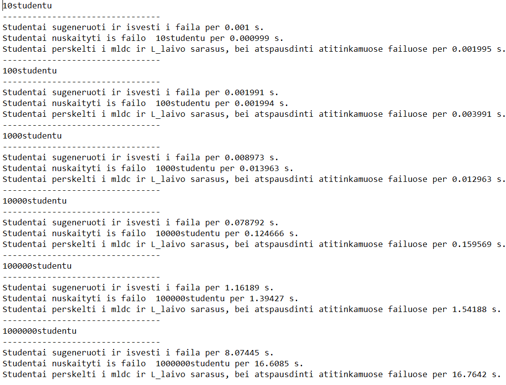

## Versijų istorija (changelog)
### [v0.5](https://github.com/gitguuddd/Obj_Duomenu_apdorojimas/releases/tag/v0.5)
(2019-03-18)


**Pridėta**
- ```splitnprint``` ir ```readfile``` funkcijoms sukurti listo ir deque variantai, nes labai pasisekė kurti funkcijų template'us (žiūrėti viršuje :) )
- ```STLpick``` funkcija, kuri leidžia vartotojui pasirinkti ar jis norės dirbti su vektoriumi/deku/listu
- Naujuose inputuose sudėtas input handling'as
- Į benchmark'o failą (v0.5_laikai.txt) išvedamas ir pasirinkto STL'o pavadinimas
- Nustatyta, kad listas lūžta, kai perlipa 19800 saugomų studentų skačių, listo generavimas apribotas iki 10000 studentų.
- 

**Koreguota**
- Visur sutvarkytas lygiavimas
- ```v0.4_laikai.txt``` keičiama į ```v0.5_laikai.txt```
- ```Generuoti studentu faila (v0.4)``` keičiama į ```Generuoti studentu faila (v0.5)``` 
- Pasirodo, kad ```Generuoti studentu faila (v0.5)``` funkcija visados generuodavo vienu studentu mažiau nei reikia. Tai sutvarkyta
- Namų darbų skaičiaus maksimalus pasirinkimas padidintas iki 1000000
- Keliose vietose panaikinti nereikalingi try-catch blokai
- Po 0.4 studentų generavimo programa į menių negrįžta ir tiesiog baiga darbą.

**Testavimo rezultatai naudojant skirtingus STL'us**
Vis dar naudojamas tas pats release profilis, -O3 flagas. Testuojama su 10 nd pažymių, bandomi abu atvejai (skaičiuoja pagal nd vidurkį/medianą).

| STL'as     | std::vector<> | std::deque<> | std::list<>  |
|------------|---------------|--------------|--------------|
| 10vid      | 0.009014 s.   | 0.005128 s.  | 0.003992 s.  |
| 10med      | 0.006949 s.   | 0.002992 s.  | 0.004979 s.  |
| 100vid     | 0.007017 s.   | 0.009007 s.  | 0.00698 s.   |
| 100med     | 0.007977 s.   | 0.007982 s.  | 0.008977 s.  |
| 1000vid    | 0.035963 s.   | 0.040521 s.  | 0.4627448 s. |
| 1000med    | 0.031945 s.   | 0.032907 s.  | 0.191491 s.  |
| 10000vid   | 0.328088 s.   | 0.323124 s.  | 7.471561 s.  |
| 10000med   | 0.310168 s.   | 0.308523 s.  | 19.684555 s. |
| 100000vid  | 3.757647 s.   | 3.352958 s.  | Nėra         |
| 100000med  | 3.35035 s.    | 3.537462 s.  | Nėra         |
| 1000000vid | 37.74918 s.   | 42.60728 s.  | Nėra         |
| 1000000med | 41.558277 s.  | 37.02453 s.  | Nėra         |

---
### [v0.4](https://github.com/gitguuddd/Obj_Duomenu_apdorojimas/releases/tag/v0.4)
(2019-03-11)


**Pridėta**

- ```Generuoti studentu faila (v0.4)``` meniu pasirinkimas kuris apjungia šias naujas funkcijas:
- **overload'inta ```Genstudent``` funkcija**, kuri sugeneruoja nurodytą kiekį studentų
   su atsitiktinais vardais, pavardėmis
   , egzaminų įverčiais ir vartotojo nurodytu namų darbų įverčių kiekiu ir šiuos duomenis išveda į failus su atitinkamais pavadinimais ```generuojamu studentu kiekis + studentu.txt```
- ```readfile``` **funkcija** kuri nuskaito duomenis iš sugeneruotų failų ir juos sudeda į students vektorių.
- ```splitnprint``` **funkcija** kuri, pagal vartotojo pasirinkimą ([m]ediana/[v]idurkis) suskaičiuoja studentų vektoriuje saugomų studentų galutinius pažymius pagal namų darbų įverčių medianą/namų darbų įverčių vidurkį, 
išrikiuoja stundentus pagal galutinį pažymį,
 randa iteratorių ties kuriuo galutinis pažymys tampa lygus 5.0, panaudoja iteratorių skeliant studentų sąrašą į ```mldc``` studentus ir ```L_laivas``` studentus, juos atspausdina į failus su atitinkamais vardais ``` studentu skaičius + studentu + v/m + mldc/L_laivas```
- Naudojant ```high_resolution_clock``` išmatuotas ```Genstudent```, ```readfile``` ir ```splitnprint``` veikimo laikai dirbant su visais studentų sąrašų variantais (10, 100, 1000, 10000, 100000, 1000000), laikai išvedami į ```v0.4_laikai.txt``` failą
- Naujose funkcijose pridėtas input/exception handling'as
- Dabar galima skelti ir atspausdinti ir duomenis kurie buvo sugeneruoti/įvesti paties naudotojo arba nuskaityti iš kursiokai.txt failo

**Koreguota**

- Kursioko Igno D. patarimu mt19937 seedinimas pakeistas iš random device
 į ```high_resolution_clock::now().time_since_epoch().count()```, nes pasirodo, kad mano kompiuteris neturi random device :(
- Sutvarkyti keli minor bug'ai susyję su informacijos išvedimu konsolėje
- Pakeistas README.md failas

**Ką artimiausiame release reiktų pataisyti, bet ko tikriausiai nepataisysių** 
- Skeliant vartotojo įvestus/sugeneruotus/nuskaitytus duomenis, sudaryti failai ne visados pasižymi puikiu lygiavimu
- Sugeneruoti studentų failai (dar neperskelti) irgi nėra puikiai išlygiuoti, nes iškart generuojant ir išvedant nėra galimybės surasti maxname ir maxsurname reikšmių
- Studentų sąrašų generavimas ir skėlimas prikuria labaiiii daug failų.
- Dėl multiple definition errorų į ```input.h``` ir ```input.cpp``` teko perkelti splitnprint funkciją, nors ji pagal veikimo principą turėtų priklausyti ```output.h``` ir ```output.cpp``` failams
- Per daug kintamųjų, kurie kaip extern'ai yra deklaruojami ```mutual.h``` 

**Laiko matavimo rezultatai ir pavyzdžiai** 
- Visi sarašai buvo sugeneruoti naudojant Release profilį ir -O3 flagą
- **Laiko matavimo rezultatų failo vaizdas visuose sąrašuose generuojant po 10 namų darbų pažymių ir pasirinkus galutinio pažymio skaičiavimą pagal vidurkį** 

- **Laiko matavimo rezultatų failo vaizdas visuose sąrašuose generuojant po 10 namų darbų pažymių ir pasirinkus galutinio pažymio skaičiavimą pagal medianą**
")


---
### [v0.3](https://github.com/gitguuddd/Obj_Duomenu_apdorojimas/releases/tag/v0.3)
(2019-02-25)

**Pridėta**
- ```Input.h, Mutual.h, Output.h, Mutual.cpp, Output.cpp, Input.cpp```
- Input handling (pagrinde ```cin.fail()```)
- Naudojami ```vector.reserve()``` ir ```vector.shrink_to_fit()```
- Exception handling (```try - catch```) ties ```students.push_back``` ir ```stud.nd.push_back```, nes pereita prie vektorių atminties rezervavimo
- Input handling nuskaitant failą - galima nuskaityti namų darbų pažymius net ir jei jie yra ne skaičiai arba mazesni uz 0/ didesni uz 10 (aptikus - nulinami), jei netinkamas input yra ilgesnis nei 4 simboliai - didelė rizika sugadinti nuskaitytų duomenų tikslumą 
- Nested switch meniu klaidų spausdinimui
- Programos struktūros sekcija README.MD faile
- 

**Koreguota**
- Panaikinti goto, taip pat ir easter egg (LINEKAPUT:), perdaryta switch logika.
- Pasirodo, kad senesnių versijų duomenys nebuvo labai tikslūs, duomenys patikslinti.
- kursiokai.txt failas tikslingai sucorruptintas norint išbandyti input handling'a.
---
### [v0.2](https://github.com/gitguuddd/Obj_Duomenu_apdorojimas/releases/tag/v0.2)
(2019-02-18)

**Pridėta**
 - Kursiokai.txt
 - Rūšiavimas pagal studento vardą ir pavardę
 - Nuskaitymas iš failo
 - Galimybė visais būdais gautus duomenis atspausdinti viename output sąraše
 - Primityvus switch'o error handling'as naudojant goto
 - Easter egg
 
 **Koreguota**
 - Pakeistas README.md failas
 
 **Žinomi trūkumai/ką reikia kuo greičiau ištaisyti**
 - Goto switche reikia pakeisti į normalų refactoringa dirbant prie v0.3
 - Studentų rikiavimas veiks keistokai jei bus naudojami ne vienodo ilgio vardai ir pavardės.
 - Nemažai vietų trūksta exception/error handling'o
---
### [v0.1](https://github.com/gitguuddd/Obj_Duomenu_apdorojimas/releases/tag/v0.1)
(2019-02-18)

**Pridėta**
- CMake failas
- Pirmininis programos ```cpp``` failas
- Alternatyvios programos (su masyvu ) ```cpp``` failas (veikiantis bardakas)

**Koreguota**
- Pakeistas README.md failas
---
## Programos struktūra
- ```Input.h``` ir ```Input.cpp``` funkcijos/kintamieji/include'ai susyję su duomenų įvedimu
- ```Output.h```ir ```Output.cpp``` funkcijos/kintamieji/include'ai susyję su duomenų išvedimu
- ```Mutual.h```ir ```Mutual.cpp``` funkcijos/kintamieji/include'ai bendri visai programai (```#include iostream```,```handleinput()``` )
- ```main.cpp``` pagrindinis failas - meniu
